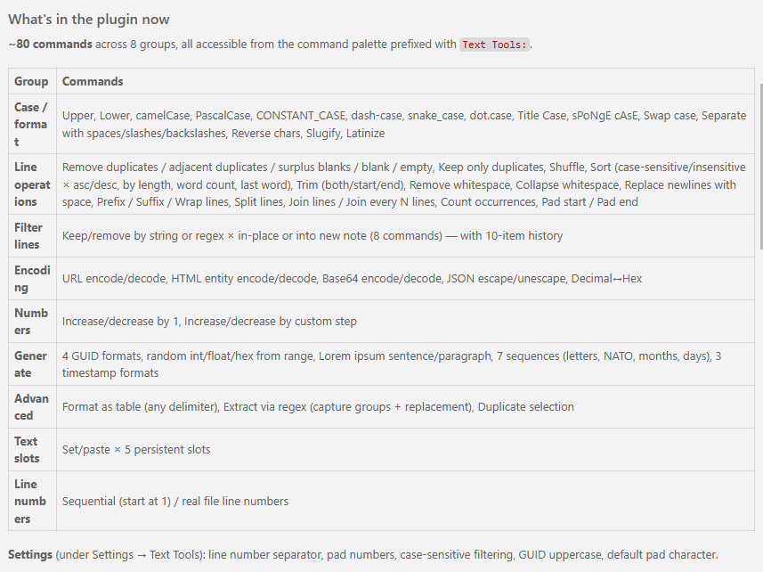

# Generate documentation and managing assets for the project

I want to adjust the name, description, and documentation in general for this project, as long as managing assets like builds and releasing. Include license information and other relevant information following the notes below. These adjustments should be reflected in the code and manifests too. 

- Title of the product: Local Text Tools
- Short description: Local Text Manipulation Tools Plugin for Obsidian

The product is a plugin for Obsidian that can be invoked with the command palette with the prefix "Text Tools:", as a short way avoiding a relatively longer title.

## References for considerations

Consider the following references as a source of good practices.

- https://docs.obsidian.md/Plugins/Getting+started/Build+a+plugin
- https://github.com/obsidianmd/obsidian-sample-plugin

## Sections to include in the documentation

Initial description, under Heading 1 with the title of the product, that should include a brief summary of the commands included in a table format like the image below:

Mention that the plugin is inspired by an existing plugin for Visual Studio Code named Text Power Tools (https://marketplace.visualstudio.com/items?itemName=qcz.text-power-tools) by Dániel Tar (https://github.com/qcz).

Section: Installation
Install the plugin via the Obsidian Community Plugins marketplace.
Enable the plugin via the Obsidian Settings under the "Community Plugins" section.
Configure the plugin parameters as needed through the settings UI.

Section: Usage
Invoke the plugin commands via the Obsidian Command Palette with the prefix "Text Tools:" followed by the specific command name.

Section: Features
Include a detailed list of the features provided by the plugin, grouped by categories. Derive the commands from the existing codebase and the command palette entries.

Section: Contributing
Include guidelines for contributing to the project, such as how to report issues, submit pull requests, and adhere to coding standards. Mention that contributions are welcome and appreciated. Include a link to the contributing guidelines document. Create an initial version based in practices from other open source projects.

Section: License
Include the license information for the project. Choose an MIT.

Section: Changelog 
Link to a changelog markdown file that includes a history of changes made to the project, including new features, bug fixes, and other updates. Create an initial version based on the existing codebase and any recent changes made.

Propose me other sections recommended for these type of open source projects.

## PRs

Create a Pull Request template that includes the following sections:
- Description: A brief description of the changes made in the pull request.
- Related Issues: A list of any related issues that the pull request addresses.
- Checklist: A checklist of items that the contributor should complete before submitting the pull request, such as testing the changes and updating documentation.

The description should be marked in a way the pipeline automation can extract it and use it for the changelog generation. Consider using a specific format or tags to identify the description section in the pull request template.
Use a list, also marked, of checkboxes to be checked that defines the nature of the change in terms of versioning. That would be the usual 3 options: 
- [ ] Major: A change that breaks backward compatibility and requires a new major version.
- [ ] Minor: A change that adds new features in a backward-compatible manner and requires a new minor version.
- [ ] Patch: A change that fixes bugs in a backward-compatible manner and requires a new patch version.
That should be used by the pipeline automation to determine the type of version bump needed for the release. No checked option would indicate that no release is needed.

## Pipeline

Create a github action pipeline that automatically generates the changelog based on the text of the Pull Requests and updates the relevant markdown files in the repository. The pipeline should be triggered on push events to the main branch and should include steps for:
- Checking out the code
- Installing dependencies
- Running a script to generate an update to the changelog and create a commit in the main branch with it.
- Optionally, creating a new release if the version bump indicates a new release is needed based on the type of change (major, minor, patch) indicated in the pull request description.

Include a proposal of whatever is needed and can be automated for publishing the release to the Obsidian Community Plugins marketplace, if possible.

## Issues

Create issue templates for bug reports and feature requests. The templates should include sections for:
- Description: A brief description of the issue or feature request.
- Steps to Reproduce (for bug reports): A list of steps that can be followed to reproduce the issue.
- Expected Behavior (for bug reports): A description of what the expected behavior should be.
- Additional Information: Any additional information that may be helpful in addressing the issue or feature request, such as screenshots, logs, or links to related issues.
Include labels for the issues to help with organization and prioritization, such as "bug", "feature request", "help wanted", etc.
